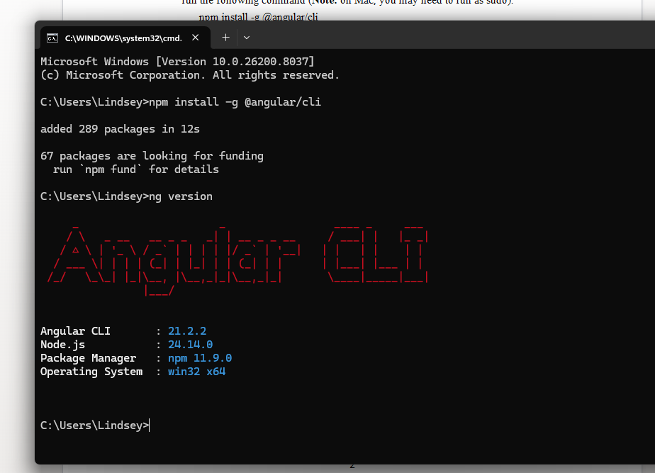
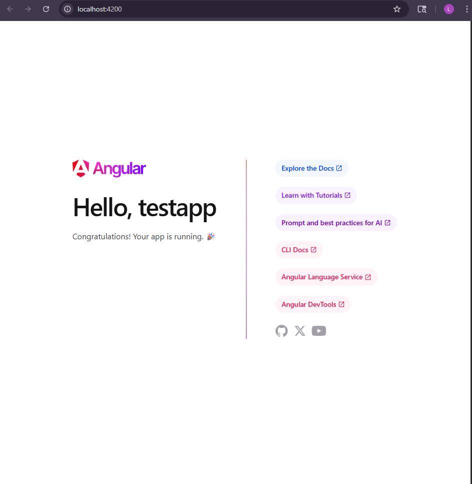
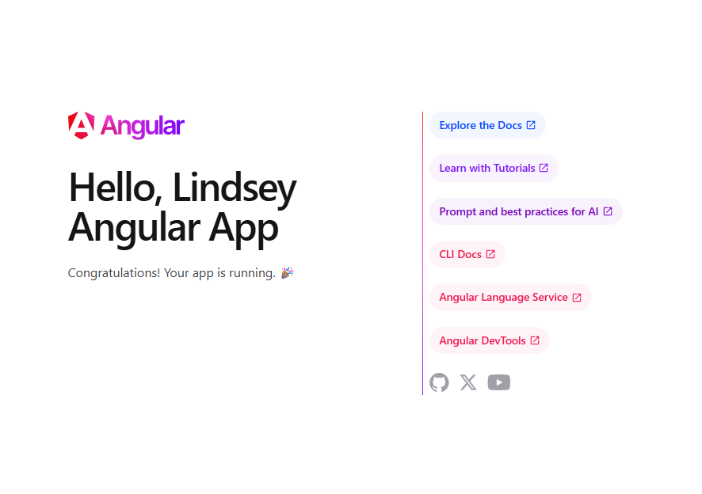
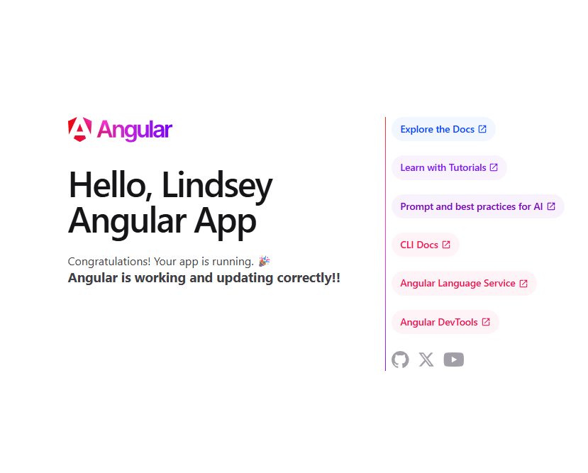

# CST391 - Activity 2: Angular Tools & First App - 
# Lindsey DeDecker
### March 16th, 2026

## Tool Installation and Understanding
Node.js and Angular CLI were installed using npm.  These tools allow developers to create, manage and run angular applications from the command line. 

## Screenshots

- ### Correct version of Angular downloaded
#### Below you can see that within the command prompt the correct version of Angular was downloaded.

- ### Angular Browser
#### Within the terminal in VS code, I was able to start the browser immediately with the command ng serve -o 

- ### Updated name
#### Below you can see that the name is now updated within the Angular app to show that it is muy application - Lindsey. This was done within the componenet file.

- ### Updated message 
#### I have now updated the message that is displayed below the the application name to show that it is working and running correctly.  This was also done within the componement file and an updated was added into app.html to allow for the h3 message. 

## Research Questions
Inspect the default test project structure created in the Activity. Describe the purpose for each of the folders of the following in the project structure: node_modules, src, src/app, src/assets, and src/enviornments. Also, describe the purpose for each of the following files in the project: angular.json, and tsconfig.json.

- When an Angular project is created, it automatically generates a structured set of folders and files that help organize the application and manage how it runs. Each folder and file has a specific purpose that helps developers build, run and maintain the application.

- **Node-modules** contains all packages and libraries that Angular needs.  These are automatically installed with npm install. This folder is to be left alone by the developer. 

- **src** contains the main source code for the application. This is where most of the development work will go. 

- **src/spp** contains the main files - componenets, templates and configuration files that all control the application.

- **src/assests** contains static files like images and resources.

- **src/environments** folder has the configuration files used for the enviornments.  These can allow setting to changes depending on where the application is running.

- **Angular.json** contains configuration information for the workspace.  It controls how the application is built, served and tested.

- **package.json** lists the project dependencies and npm scripts used to run commands like installing packages, starting the server, or building the application. 

- **tsconfig.json** has the typescript settings.  These tell the compiler how to convert ts into Javascript so that it can run within the broswer. 

Inspect the page source for the default page displayed when running the test project. Explain how the resultant page was generated by Angular by providing a brief overview and purpose for each of the following files: main.ts, app.component.css, app.component.html, app.components.ts, and app.module.ts.

- When the Angular application runs, the page that appears in the broswer is generated by Angular's framework using several files that work together. 

- **main.ts** This is the main file and the one that will start the application and load all the root compnents.

- **app.componenet.ts** This file defines the main componenets of the application. It has the logic for variable and properties that are used within the template.

- **app.component.html** This is the html template.  This defines the structure of the page and display data. 

- **app.component.css**  This is the style page. It controls how the pages will look and appear.

- **app.module.ts** This configures the application.  It imports modules and tells the application everything it needs to work properly.

## Resources
- https://www.geeksforgeeks.org/angular-js/folder-structure-of-angular-project/
- https://www.youtube.com/watch?v=5DKMS_VnMC4