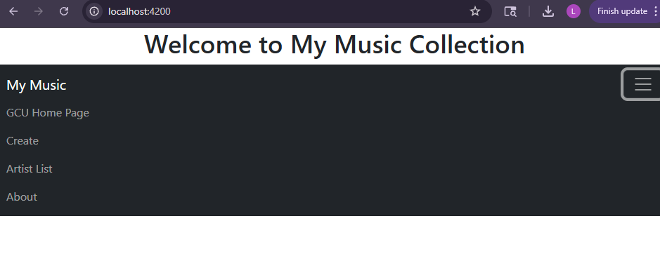
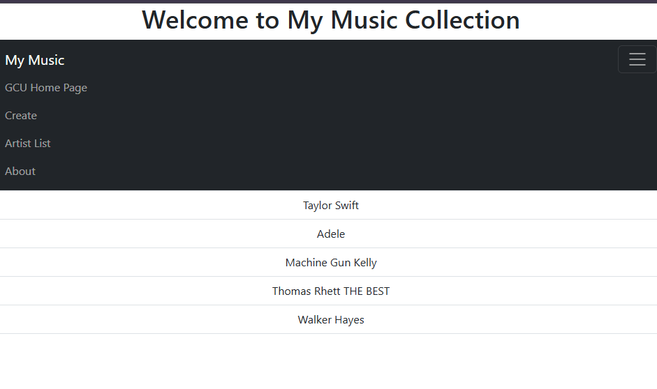
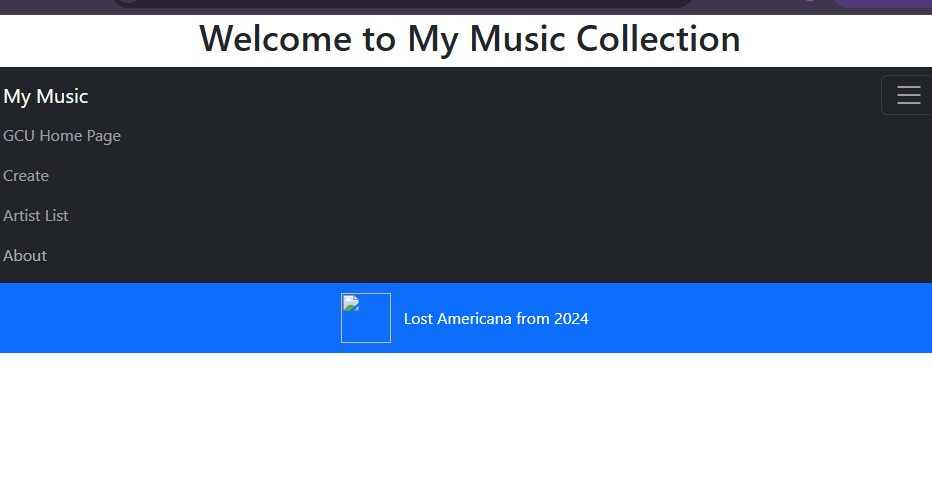
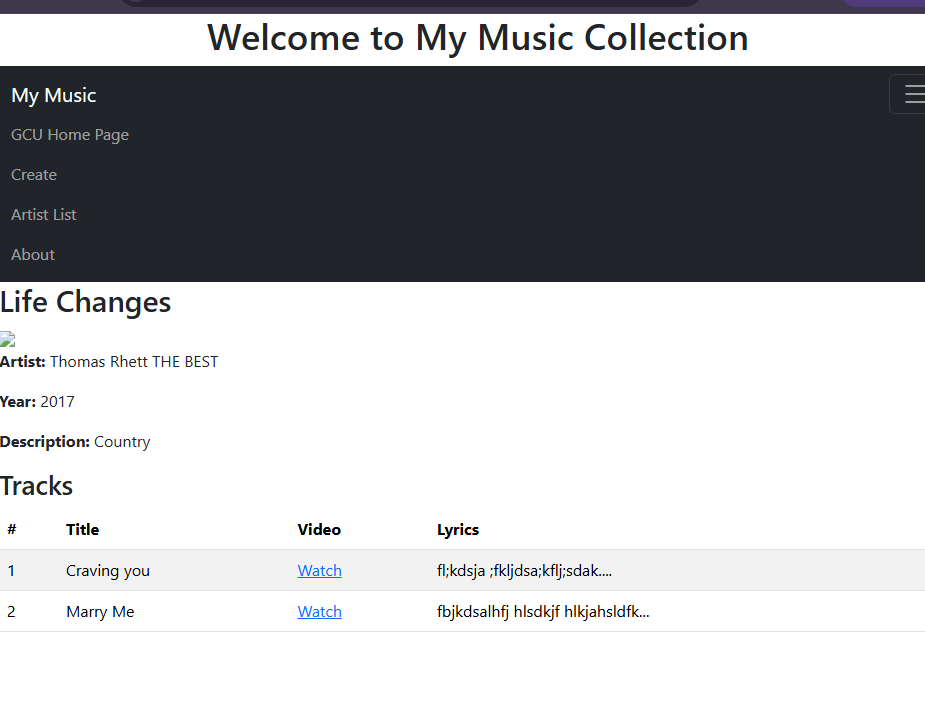
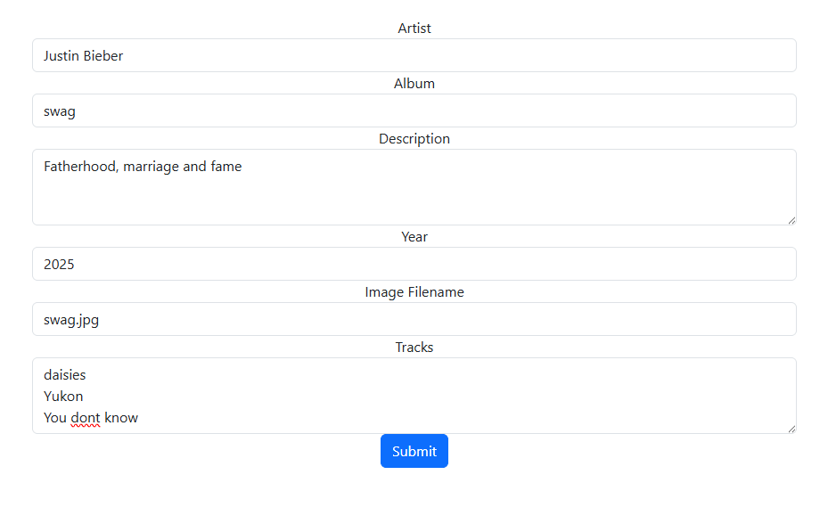
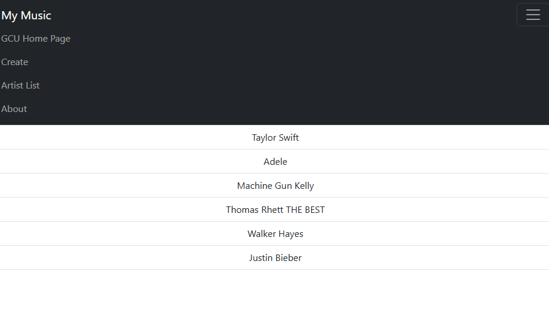

# CST391 - Activity 4: Angular Music App API Data
# Lindsey DeDecker
### April 22nd, 2026

## Activity 4
In this Activity I integrated the music application I had created with the back end services from Topic 1. For front end I used Angular. I configured the Angular app to use HTTP to replace hard coded data with live data from the backend API.  I updated music service to make API calls for retrieving artista and albums as well as creating them. The applicaiton was tested a lot and had issues throughout production with pulling the information correctly.  Through problem solving, the applicaiton is running as expected.  

## Link to backend code
- https://github.com/lindsdeck/CST391/tree/main/activities/topic4/musicapp

## Screenshots

- ### Main Application Screen
#### Below you see the main loading page of the Music application. It inclued the applicaiton title and the navigation menu. The navigation menu allows users to view and create a new album/artist and to navigate to the GCU home page. 

- ### Artist List Screen
#### Below you will see the lists of artist that the UI was able to pull from the backend API upon selecting artist list from the navigation bar.  Angular uses HTTPClient to erequest the data.  Each artist is able to be clicked on to see their album list. 

- ### Album List
#### We now see the albums of the artist that waws selected. Again the applicaiton pulls the data from the backend API using Angular HTTP.  Users are again able to select an album to get more details of the album. 

- ### Album Display with Tracks
#### Below we see the details of the album now including year, descriptiona dn tracks.  We also have a clickable link that will take us to a vidoe of the song. 

- ### Add Album
#### This is the form the user can interact wtih to add a new album.  The user will enter all the details within the form and submit it.  Next we can see that the submission of the new artist, Justin Bieber, was successful as he was not on the list above. 

## Research Questions
Research how an Angular application maintains a logged in state. How does it communicate this state to the server?
- Angular maintains a logged in state by storing a form of authentication information on the client after the user has signed in.  This is most commonly session cookie managed by the browser or a token stored by the application. Broswer storage such as localStorage can preserve data across browser sessions while the server issued cookies are also commonly used to remember authenticated users. To communicate the logged in state to the server, the application usualy send either an authentication cookue wuth thge request or an authorization header through HTTP.  Overall, Angular maintains login state by keeping authentication data avaliable and communcated that state to the server by attaching cookies or auth headers on each request so that the server can verify the user before returing protected data.

## Discussion Questions
1. Research the Vue.js framework. PRovide one to tow advantages and one to two disadvantages of using it. Justify your rationale with reliable and valid information. 
    - Vue.js is a JavaScript framework for creating interactive and dynamic UIs and is similar to React. One advantage of Vue.js is that it is easy to learn and manage, which makes it a great option for not only experienced developers, but also beginners. It has simple syntax and clear documentation making it easier for developers to understand it. Another advantage is that it has a large and active community behind it. You will have support, resources and a large ecosystem of libraries and plug ins. This makes it a great option as it opens the door for you to be able to do many different things with it and have the support that you might need along the way.
    - One disadvantage of Vue.js is that it is similar to React, but has a smaller library, tools and resources compared to that and Angular. So while it is a good option, React and Angular might be a better option for their larger ecosystems. I also found that it is rapidly evolving. This can be a positive in some ways, but can also lead to inconsistencies, instability or the breaking of changes in early version of the framework. Overall, Vue.js is a good JavaScript option with its simplicity, flexibility and performance. It will give you the tools that you need to make a reactive web app.
2. Think about the factors one should consider when selecting a cloud provider. Identify two to three and justify rationale.

    - When selecting a cloud provider, some important factors are considering the security, cost and scalability.  Security is important because cloud enviornments often store sensitive data, so providers must offer strong encryption, access control and complaince with standars such as HIPPA to protect against breacher. Cost is another key factor since lcoud services can become expensive as usage grows. Understanding each providers pricing model can help avoid unexpected expenses and ensure the solution fits within the budget.  Scalability is essential because it allows applications to grow or shrtink based on demand, ensuring consistent performance without overpaying for unused resources. Considering these factors helps enmsure the selected clloud provider meets both current needs and future growth requirements. 

### Resources
- https://www.ifourtechnolab.com/blog/angular-login-with-session-authentication