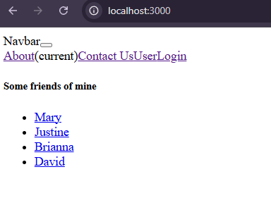
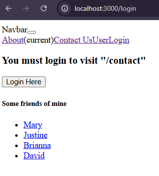
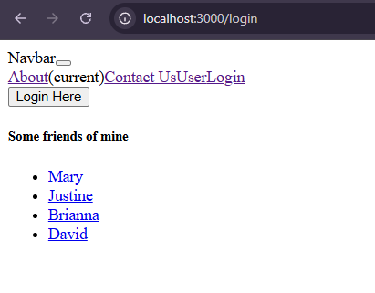
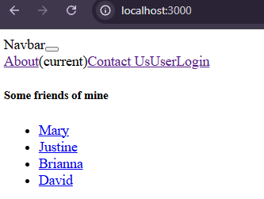
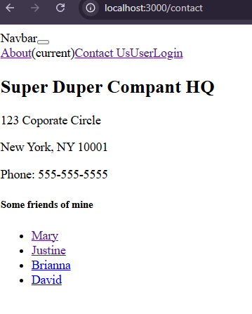
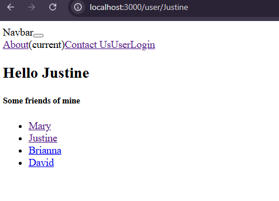
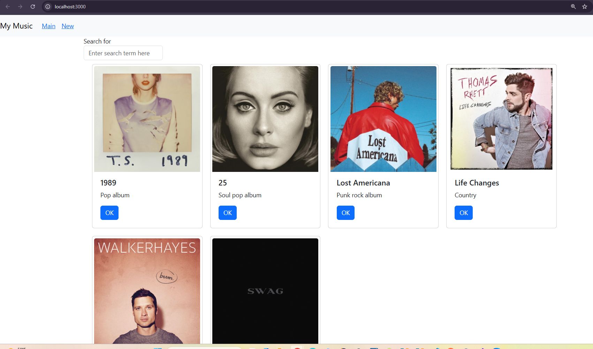
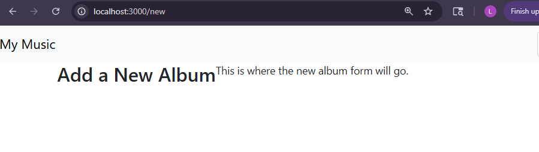
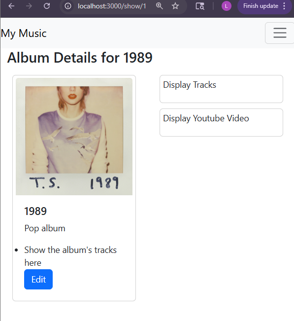

# CST391 - Activity 6: React Music App API Data
# Lindsey DeDecker
### April 22nd, 2026

## Activity 6
 
# Part 1

## Screenshots

- ### Search Console
#### This screenshot shows that the React front end is successfully capturing the user input. The console confirms that the value entered into the search box is being recognized and stored as the search phrase.

- ### Search Result
#### This is the search functionality working correctly. The applicaiton filters and dsiplays the appropriate albums based on the user's input.  

- ### Backend MySQL displaying
#### Below shows that the application is successfully connected to the backend API created in Activity 1. The data stored in the MySQL database is being retrieved and displayed correctly in the front end.

- ### Search Functioning with Backend
#### The search functionality is working with data retrieved form the backend API. The application correctly filters and displays results based on user input using live database data.

## Summary of new features
In this activity, I integrated a RESTful API and implemented data handing using React. The application now retrieves album data from an Express backend connected to a MySQL database using axios. I also implemented a SearchForm component that captures user input and updates the displayed album list through state management. Key concepts that were introduced include: async/await, API communication, React State and React Prop. These allow the applicaiton to load, display and filter the data.

# Mini App #2 - Routing Application Demo

## Git link to Mini App Code
- https://github.com/lindsdeck/CST391/tree/main/activities/topic6/router

## Screenshots

### Mini App Home Page

#### This is the main page of the application. The navigation bar is displayed at the top along with tlinks to the different routes. There is also a list of users that when selected will navigate to their user page.

- ### Protected Route
#### The user has attempted to contact, but you can see that this is a protected route and the user must login before accessing it.  

- ### Login Page
#### This is the login page. The login button allows the user to authenticate and continue.

- ### After Login Redirect
#### After clicking the login button, the application updates the login state and redirects the user back to the origionally requested page. THis demonstrates how navigation and state are used together to control access to protected routes

- ### Contact Us
#### Now that the user is authenticated, we can see the contact ionformation is loading as expected.

- ### User Route
#### We can see the dynamic route where the applicaiton displays content based on the username provided in the URL. THis shows how React Router handles parameters in routes.

## Summary of new Features
In this mini application activity I implemented routing and authentication using React Router. I created multiple routes for different pages and added protected pages that require a user to be logged in before accessing them. When a user logs in they are redirected to the home page with the useNavigate hook. Key concepts include routing, protected routes, navigation, state management, and passing between components using props. 

## Part 4

## Screenshots

- ### Main Page
#### This shows the main page of the application with the navigation bar and album list. The application is now using routing to control which components are being displayed.

- ### Final React Album Cards
#### We can see that the navigation bar is using React Router. Clicking on the link 'new' updates the URL and displays different components without reloading the page.

- ### Single Album Page
#### This shows dynamic routing feature of the applicaiton. When an album is sleected, the applicaiton navigates to a route containing the album ID and displays detailed information using OneAlbum.

## Summary of new features
In this part, I added navigation routing to the music app using React Router.  The app now has multiple routes, album search, New Album page, and sinlge album detail page. I also added navigation bar so users can move between routes without refreshing the page. The album list was seperated into SerachAlbum and AlbumList to help organize the application and make the code easier to manage.  The part intgroducted routing, componenet refactoring, dynamic route parameters, and passing data between componenets through props. 

## Discussion Questions
1. What do you prefer better, the front-end or back-end aspects of development? Why?
    - I like both for different reasons, but for overall enjoyment I would say I prefer front-end development. Front-end is nice because you are able to be creative and build the look and feel of an application or page. I enjoy being able to create something and then change the aesthetics while immediately seeing the results of what I have made. There is also a sense of instant gratification, since you can quickly see the changes as you are working. Back-end is also appealing because of everything you can build and control behind the scenes. It feels great to create functionality that processes user input and connects to databases. I think that back end is interesting because of how much you can do with it, and it is especially satisfying when everything comes together and you can see the final product working as intended.

2. What ethical issues can exist in web applications? Provide two specific examples and justify your rationale. From a CWV perspective, how would you address this?

    - Ethical issues in web applications can include data privacy misuse and manipulative design practices. Data privacy misuse is where applications colelct or share user data without clear consent or full transparency. This can include tracking user behavior or selling data to third parties, which violates user trust and can lead to serious consequences like identity theft or loss of personal security. A second example is "dark patterns,' which are design techniques that intentially guide users into action they may not fully understand, such as hiding unsubscribe options or making cancellation difficult. These practices put profit over user autonomy. 
    - From a CWV perspective, both of these issues relate to the importance of honesty, integirty and respect for others. We should treat our fellow people with dignity and avoid deception. As developers, this means designing applications that are transparent, protect user data, and respect user choices. Addressing these issues involves being clear about data collection, giving users control over their information and avoiding manipulative design. By doing so, developers ensure that technology serves people ethically rahter than exploiting them.

