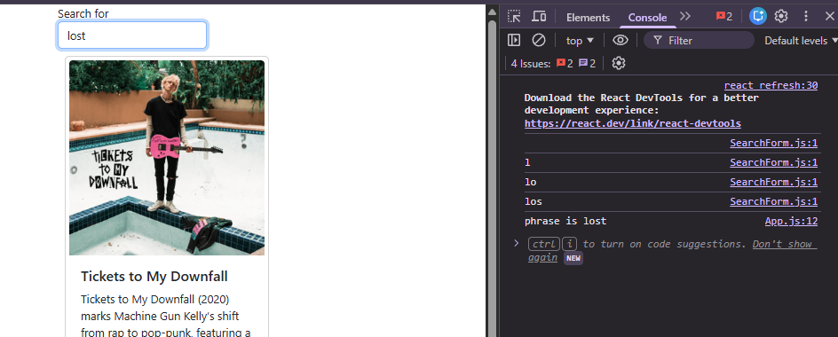
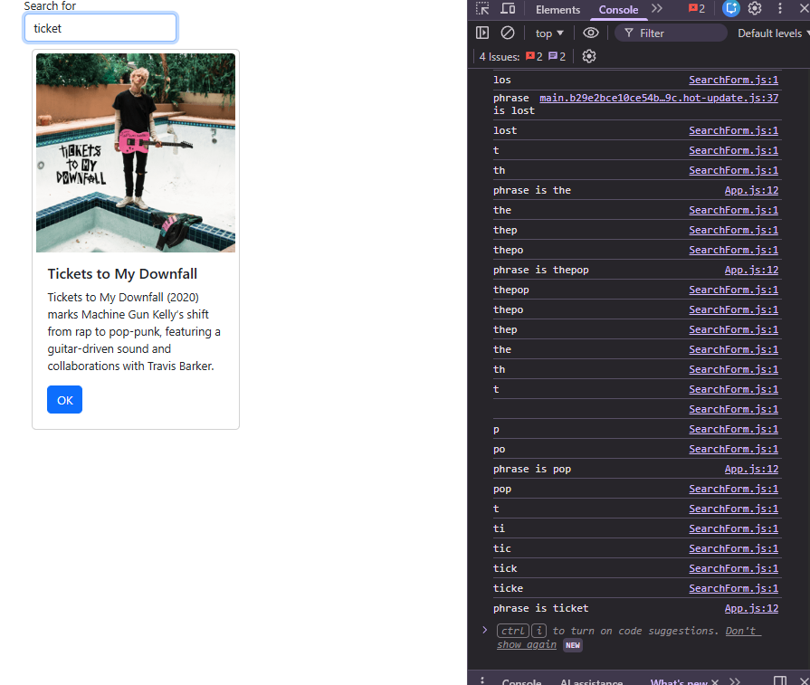
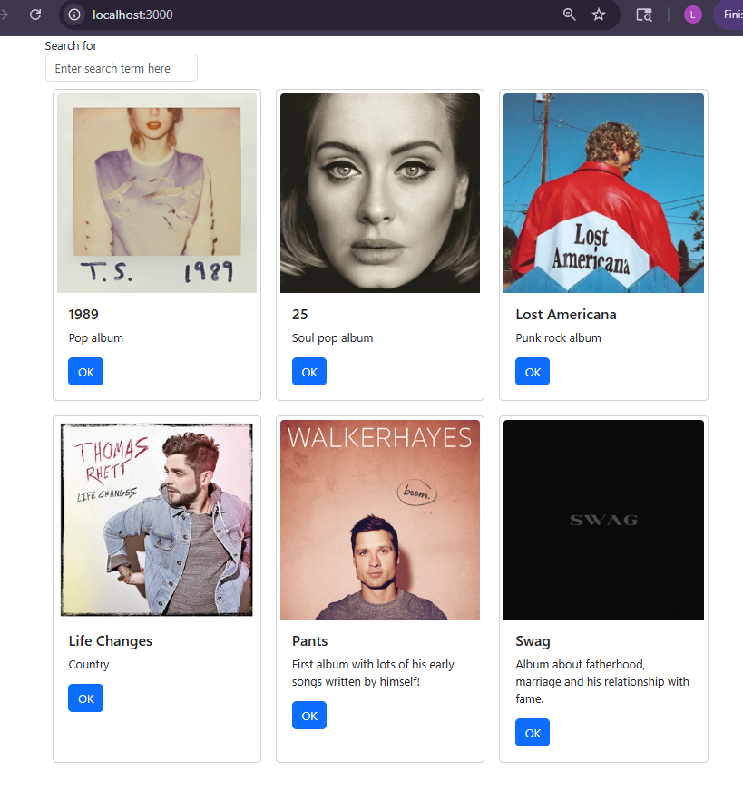
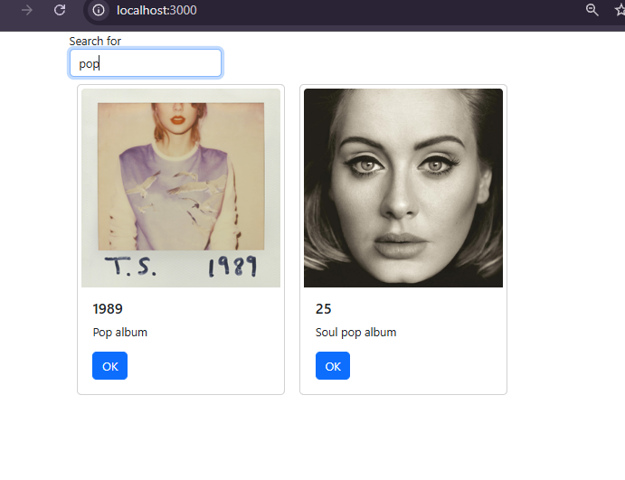

# CST391 - Activity 6: React Music App API Data
# Lindsey DeDecker
### April 22nd, 2026

## Activity 6
 
# Part 1

## Screenshots

- ### Search Console
#### This screenshot shows that the React front end is successfully capturing the user input. The console confirms that the value entered into the search box is being recognized and stored as the search phrase.

- ### Search Result
#### This is the search functionality working correctly. The applicaiton filters and dsiplays the appropriate albums based on the user's input.  

- ### Backend MySQL displaying
#### Below shows that the application is successfully connected to the backend API created in Activity 1. The data stored in the MySQL database is being retrieved and displayed correctly in the front end.

- ### Search Functioning with Backend
#### The search functionality is working with data retrieved form the backend API. The application correctly filters and displays results based on user input using live database data.

## Summary of new features
In this activity, I integrated a RESTful API and implemented data handing using React. The application now retrieves album data from an Express backend connected to a MySQL database using axios. I also implemented a SearchForm component that captures user input and updates the displayed album list through state management. Key concepts that were introduced include: async/await, API communication, React State and React Prop. These allow the applicaiton to load, display and filter the data.

# Mini App #1 - State Changer Demo

## Git link to Mini App Code
- https://github.com/lindsdeck/CST391/tree/main/activities/topic5/statechanger

## Screenshots

- ### Mini App Home Page
#### The three counter cards are displayed as expected. Each card includes a text input box and a button that allows the user to type a message and click to update the counter.

- ### Click Counter Update
#### When clicking on the 'click me' button, the application icreases the click count by 1.  This demonstrates a state change in React, where the updated value is immediately reflected on the screen. 

- ### Message Update
#### The message update feature also works correctly. As the user types into the input box, the message updates instantly wihtout needing to click a button. This shows how React updates state in real time based on user input.  

- ### All counters funtion 
#### The final image shows all three counter componenets working correctly.  Each counter maintained its own state, and both the click counter and message update features funtion across all cards. 

## Part 2

## Screenshots

- ### Final React Album Cards
#### This is the final layout of the music application after adding CSS styling to display the cards horizontally with some space between them.  This shows how React and CSS work together to create a positive UI for the user experience.

## Summary of new features
In this part, I was able to use new React features. I used state to store data inside a component.  I used props to pass from a parent component to a child component which allowed the Card and Counter components to display different values. The map() function was used to loop through the array of album data to create the card componenets. CSS flexbox was used to display the cards horizontally on the page.  

## Discussion Questions
1. Research what a Javascript framework is and how does it differ from programming in standard Javascript. Explain the motivations for learning a Javascript framework.
    - A JavaScript framework is a pre-built structure that developers use to build web applications more efficiently instead of having to write everything from scratch. When you are working with standard JavaScript, you have full control which can be nice, but you also have to handle things like organizing the code, managing the UI, and handling user interactions all on your own. Frameworks come with the built in tools, patterns and rules that guide how you write your code, which can make development faster and more consistent. They are also nice because you can use them as a foundation and then customize it and change what you need to to make it your own and what you want. The biggest reason to learn a JavaScript framework is that it simplifies tasks, makes project building faster and they are widely used, so it can be a helpful thing to be able to add to your list when looking for jobs and marketing yourself.

2. Research three popular Javascript frameworks. Give examples of which companies or well-known applications are using them. What is the growth projection for each company and/or application? Gather data about frameworks from job postings on indeed.com or other online job boards. What can you deduce from your research?

    - Three of the most popular Javascript frameworks are React, Angular and Vue.js and each one is seen in the current job market. React was created by Meta and is the most popular with companies like Facebook and Netflix. It appears the most in job postings. It is component based structure and large ecosystem is part 9of what makes it so popular.  Angular is maintained by Google and is common in enterprise-level applications like Microsoft and large financial instituitions. It might not be as popular, but still is used commonly and is liked because of its stability and suitability for large scale systems. Vue.js is used by Gitlab and Alibaba is nice because it is simle and easy to use and learn.  This is making it popular for start ups and smaller teams. 
    - Based on what I have found for job trends, React offers the strongest employment opportunities, Angular is valuable in enterprise enviornments and Vue is flexible and growing.  Overall, learning React would provide the most immediate job opportunities, but knowing all three will help make me a more valuable candidate overall as it would not hold me back from other opportunities. 

### Resources
- https://www.ifourtechnolab.com/blog/angular-login-with-session-authentication