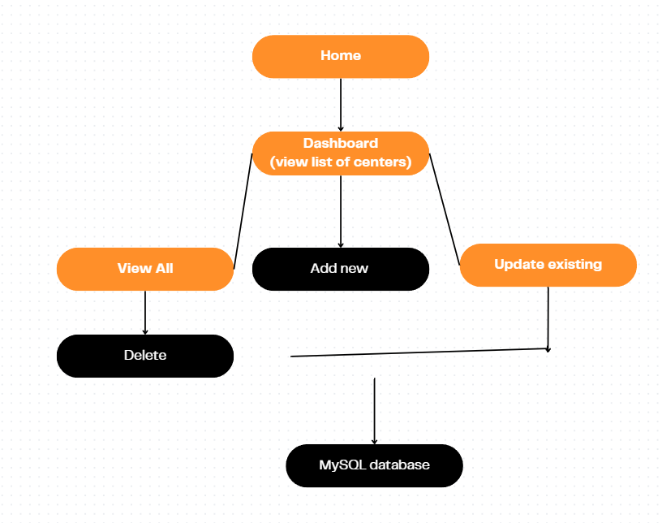
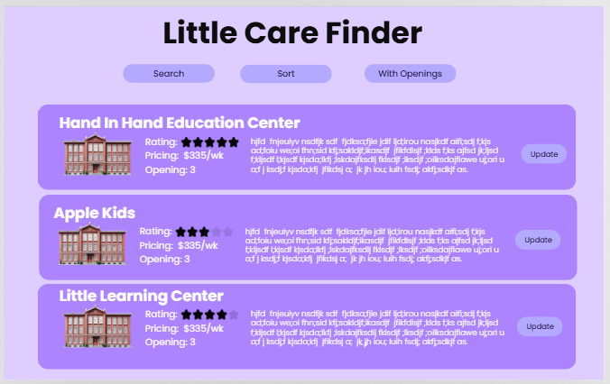
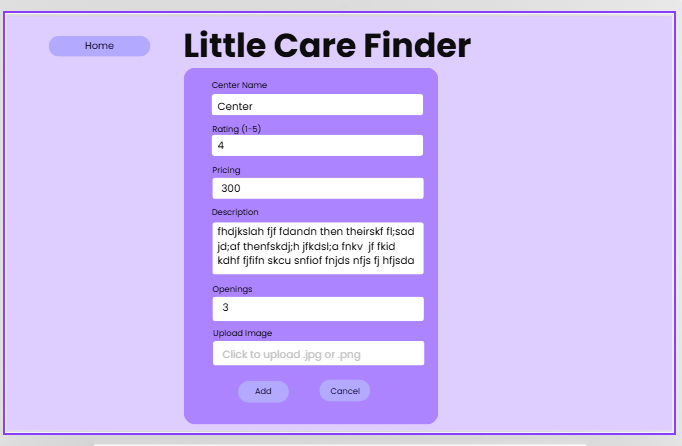
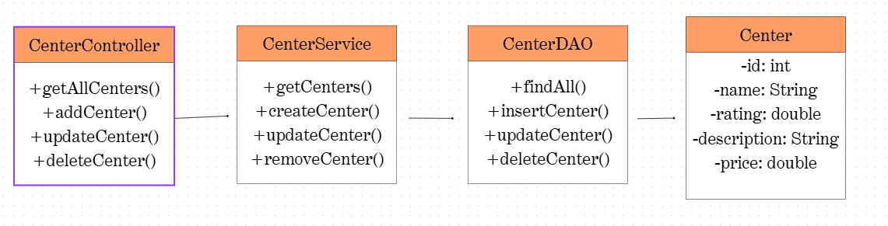

# Grand Canyon University (GCU) Programming in Java III CST-339 - Milestone 4
# Lindsey DeDecker
# April 15th, 2026

## Project Status and Design Report

### Initial Planning

To start this project, I first organized all my projects correctly in git. I created and got my GitHub repository organized correctly to match the course format.  Making sure that my activity and Milestone assignments were in the correct folders.  I used Git Bash and became very farmiliar with that to complete the repository organization.

I then shifted the focus from planning the project to implementation and testing.  Work was completed in Visual Studio Code.  Backend functionality, database connectivity and API endpoints were the main goal with this project. 

Begin integrating the application layers:
- Backend logic in the application
- Database connectivity using MySQL
- API testing using Postman

---

### Retrospective Results

Successes
- Successful API endpoint testing.
- Establishing a working database connection
- Successfully built and tested the backend with the database and API endpoints

Small challenges
- Debugging database connection issue
- Creating a small flow error between the backend logic

Any challenges were resolved during development and it is working as expected. 

---

## Design Documentation

### General Technical Approach

Layered architecture approach
- **Controller Layer**: Handles incoming API requests
- **Service Layer**: Contains business logic
- **Data Access Layer DAO**: Manages communication with the MySQL Database
- **Database Layer**: Stores persistent application data

Development is being done one step at a time through the milestones.  The layers are being tested as they are being created. Postman was used to validate the API endpoints before creating the UI. This layerd structure ensures clear seperation of concerns and allows each part of the application to be developed, tested, and maintained independently.

---

#### Key Technical Design Decisions

- **Visual Studio Code** for development.
- **REST API endpoints** for handling all application requests
- **Postman** for testing the API endpoints seperately from UI
- **MySQL Workbench** for database creation and storage
- Structred code into controllers, services and data access objects to allow it to be easy to maintain and scale

---

#### Risks

- Database connection issues could prevent data from being properly stored or retrieved
- Testing and proper documentation as creating will be important as the project grows to maintain it. 

--- 

### Division of Work (Solo Approach)

All aspects of development, design and documentation are done by Lindsey.

Responsibilities:
- Designing application
- Writing backend application in VSC
- Designing and testing API endpoints
- Creating and managing MySQL Database
- Debugging and validating application functionality
- Documenting progress and project details in Markdown

---

## Sitemap Diagram

## User Interface Diagram 

## Class Diagram 

## Service API Design 

The applicaiton uses REST API endpoints.

Examples:
- 'GET /centers' - Retrieves all centers from the database
- 'GET/centers/{id}' - Retrieves a specific center by ID
- 'POST /centers' - Create a new center
- 'PUT /centers{id}' - Update and existing center
- 'DELETE /centers{id}' - Delete a center

These endpoints have been tested in Postman

---

## Security Design 

Basic security has been implemented and security will be expanded in future projects as the milestone grows. It currently includes validating input data before processing it. 

## Screencast URL 

- [My Presentation](https://www.loom.com/share/06a7a473359d45c69186c8d925c7fe01)

This presentation demonstrates the applicaiton for Milestone 3. It includes a quick look at the structure and code in Visual Studio Coe, testing the API endpoints in Postman and verifying the database interactions.  

