# Grand Canyon University (GCU) Programming in Java III CST-339 - Milestone 5
# Lindsey DeDecker
# April 25th, 2026

## Project Status and Design Report

### Initial Planning

To start this project, I first organized all my projects correctly in git. I created and got my GitHub repository organized correctly to match the course format.  Making sure that my activity and Milestone assignments were in the correct folders.  I used Git Bash and became very farmiliar with that to complete the repository organization.

I then shifted the focus from planning the project to implementation and testing.  Work was completed in Visual Studio Code.  Backend functionality, database connectivity and API endpoints were the main goal with this project. I began integrating the application layers: backend logic in the application, Database connectivity using MySQL and API testing using Postman.

#### Milestone 5

This milestone has me creating a new front-end with React and connecting it to the previously developed REST API from Milestone 3. The React frontend was developed using Visual Studio Code and integrated with the backend API using Axios for HTTP requests. The application now allows users to perform CRUD operations on childcare centers through a component based UI.

Features added:
- Navigation using React Router and a Bootstrap navigation bar
- List view to display all childcare centers
- Detail view to display the information for one center
- Form view for creating a new center
- Edit form for updating an existing center
- Delete funtionality within the single center view
- Integration wtih the backend API using Axios

---
## Screenshots of Application

### React Back-end Connection
#### The React app has successfully retrieved and displayed the Care Center data from the backend API connected to MySQL database.
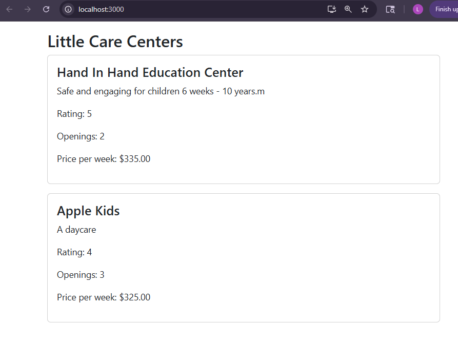

### NavBar and New Center Form
#### 'Add Center' is functioning and I have navigated here from the navbar. A new center is added through the React form and stored in the backedn vis POST requests. 
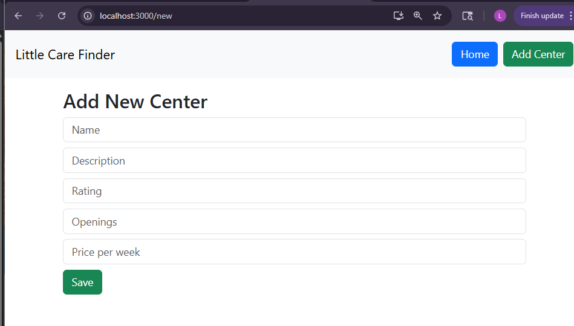

### Center Detail View
#### First we see the 'add new center form' with data input iinto the boxes. updonselecteding 'submit' we are brought back to the home page which we can see in the second screenshot. It immediately has updated the center list and is displayed the new center that was added.
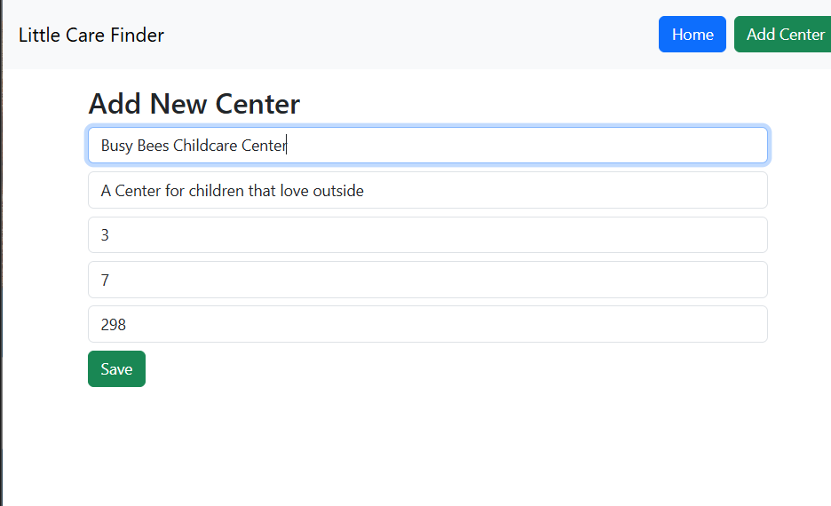
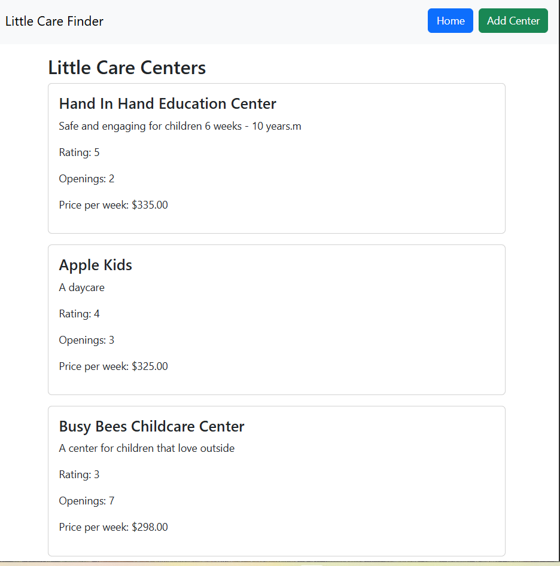

### New Center form Functioning
#### This is the detail view of a center. It loads upon clicking on the center from the home page using dynamic routing to retrieve and display the data based on the center id.
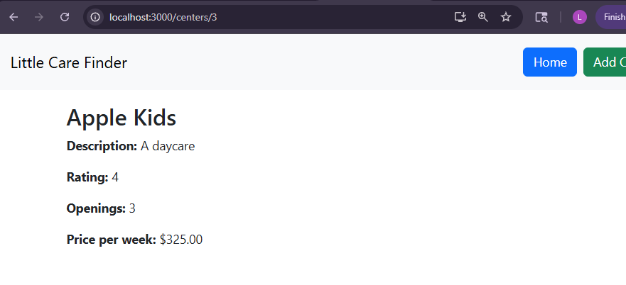

### Delete Function
#### Detailed view of the selected center with the delete button.  After selecting the delete button we are taken right back to the home page where it immediately displays the updated data without the deleted center listed. We can see that in the second screenshot. This is done through the DELETE request.
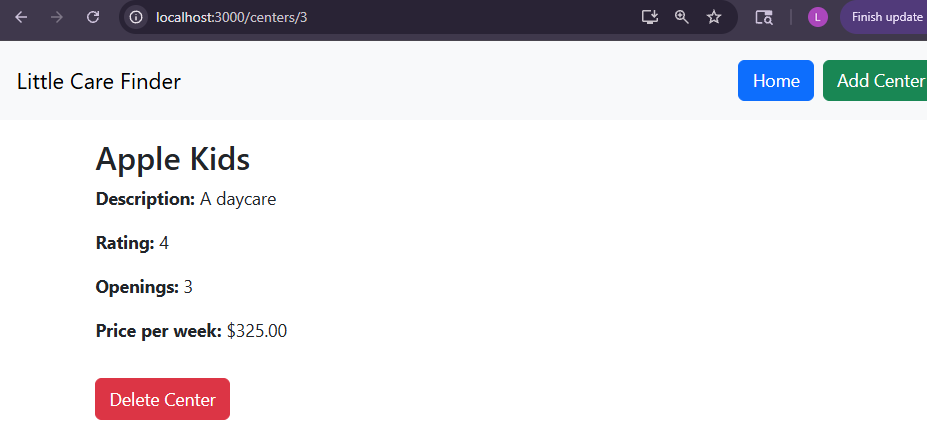
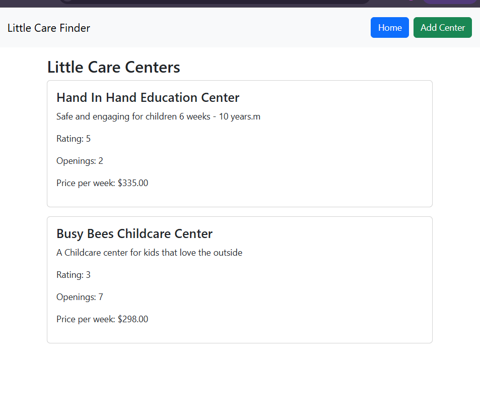

### Edit Function
#### In the detailed view of the center we have a button for editing the center, this is shown below. Upon clicking on the edit button we see the form with the centers current data entered.  This is the second screenshot. Here I updated the centers openings to 6.  Upon selecting 'update' we are immediately routed to centers detail page where we can see the data was updated.   This uses the PUT request to update the centers details.
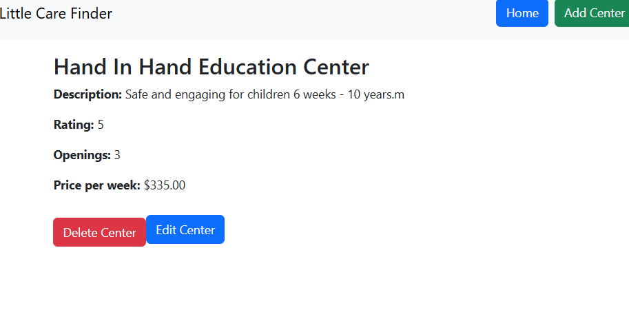
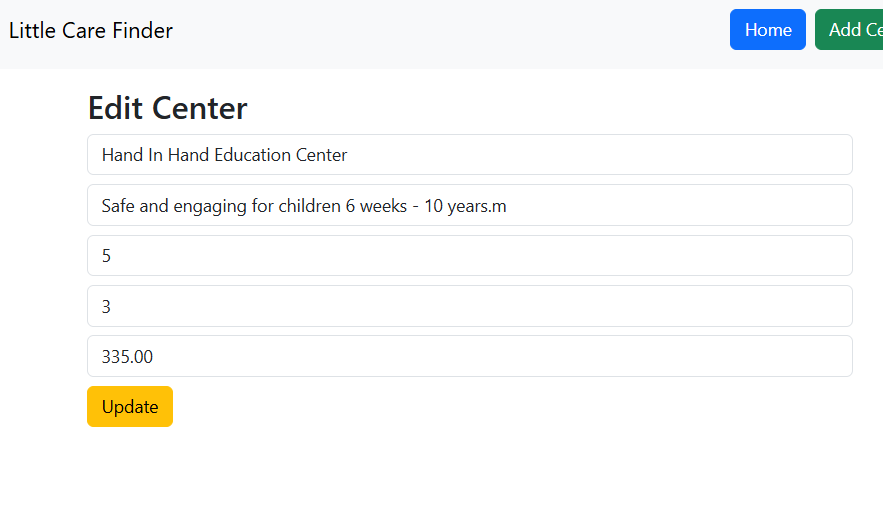
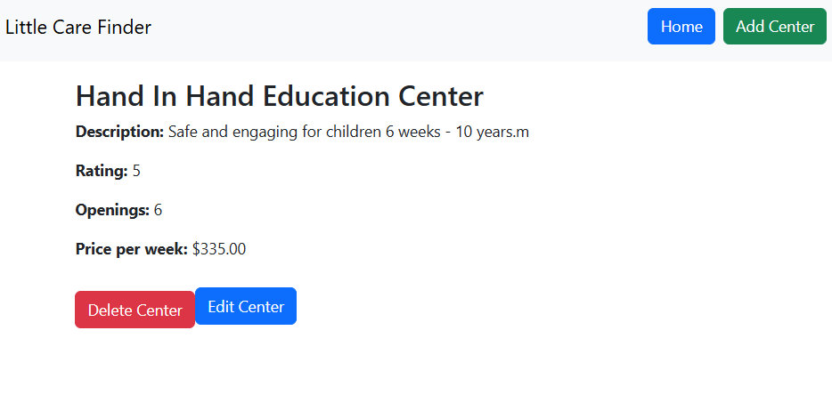

### Retrospective Results

Successes
- Successful API endpoint testing.
- Establishing a working database connection
- Successfully built and tested the backend with the database and API endpoints
- Successfully transitioned from Angular to Reach front-end
- Implemented React components and state management using hooks (useState, useEffect)
- Integrated React Router for navigation between pages
- Successfully connected React frontend to existing REST API
- Implemented full CRUD functionality

Small challenges
- Debugging API request errors
- Resolving issues wtih route parameters and passing IDs correctly
- Managing state updates after create and delete operations

Any challenges were resolved during development and it is working as expected. 

---

## Design Documentation

### General Technical Approach

Layered architecture approach
- **Controller Layer**: Handles incoming API requests
- **Service Layer**: Contains business logic
- **Data Access Layer DAO**: Manages communication with the MySQL Database
- **Database Layer**: Stores persistent application data

Development is being done one step at a time through the milestones.  The layers are being tested as they are being created. Postman was used to validate the API endpoints before creating the UI. This layerd structure ensures clear seperation of concerns and allows each part of the application to be developed, tested, and maintained independently.

---

### Front-End Design

The front end was developed using React and follows a component-based architecture

Key components
- **CenterList Component**: Displays all centers retrieved from the API
- **CenterDetails Component**: Displays deatiled information for a center based on ID
- **CenterForm Component**: Created a new center
- **NavBar Component**: Provides navigation using React Router
- **EditCenter Component**: Allows an existing center to be updated

React hooks were used for state and lifecycle management
- useState for managing component state
- useEffect for loading data from the API

Routing was configured using React Router to allow navigation between views:
- / -Home page displaying all centers
- /new - Created a new center
- /centers/:id - View a specific center

Axios is used to communcate with the backend API through HTTP requests.

---

#### Back end design 

- **Visual Studio Code** for development.
- **REST API endpoints** for handling all application requests
- **Postman** for testing the API endpoints seperately from UI
- **MySQL Workbench** for database creation and storage
- Structred code into controllers, services and data access objects to allow it to be easy to maintain and scale

---

### Design Updates and Known Issues

| Item | Update Made | Status |
|------|-----------|--------|
| React Frontend | Replaced Angular UI wtih React | Complete |
| Navigation | Implemented React Router and Bootstrap NavBAr | Complete |
| CRUD UI | Implemented Create, Read, Update, Delete | Complete |
| API Integration | Connected React frontend using Axios | Complete |
| Error Handling | Basic error handling | Partial |
| Search/Filter | Not implemented | Known Issue |

#### Risks

- Database connection issues could prevent data from being properly stored or retrieved
- Testing and proper documentation as creating will be important as the project grows to maintain it. 

--- 

### Division of Work (Solo Approach)

All aspects of development, design and documentation are done by Lindsey.

Responsibilities:
- Designing application
- Writing backend application in VSC
- Designing and testing API endpoints
- Creating and managing MySQL Database
- Debugging and validating application functionality
- Documenting progress and project details in Markdown

---

## Sitemap Diagram

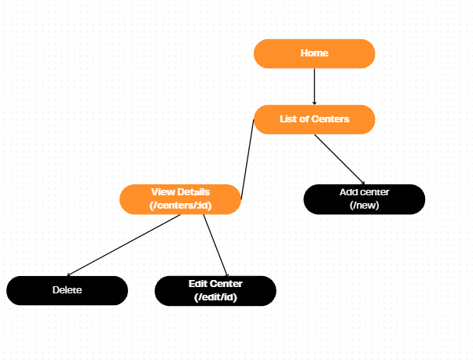

## User Interface Diagram 

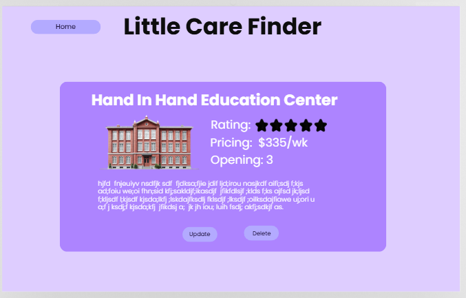

## Class Diagram 

## Service API Design 

The applicaiton uses REST API endpoints.

Examples:
- 'GET /api/centers' - Retrieves all centers from the database
- 'GET /api/centers/{id}' - Retrieves a specific center by ID
- 'POST /api/centers' - Create a new center
- 'PUT /api/centers{id}' - Update and existing center
- 'DELETE /api/centers{id}' - Delete a center

These endpoints have been tested in Postman and are now working correctly through the React frontend application. 

---

## Security Design 

Basic security has been implemented and security will be expanded in future projects as the milestone grows. It currently includes validating input data before processing it. 

## Screencast URL 

- [My Presentation](https://www.loom.com/share/e2680186fcc5480cb2b32c84252a6017)

This presentation demonstrates the completed React application including navigation using React Router, Create, Delete, Read, and Update. The UI updates dynamically based on the user interactions and communicates with the backend API in real time.

